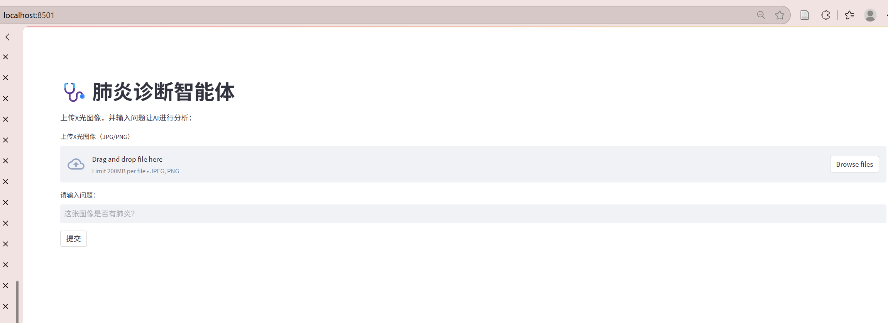
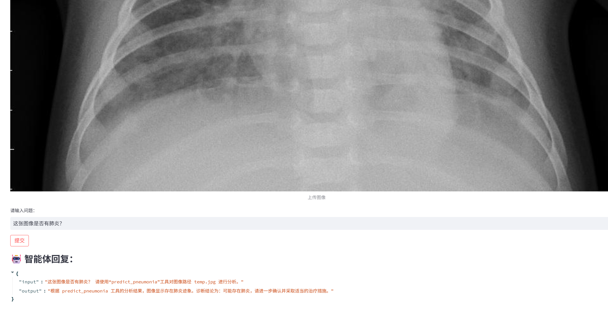
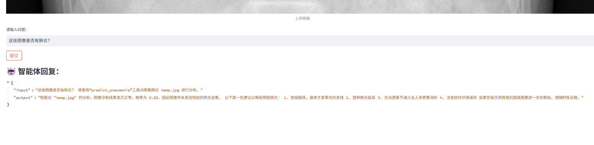

# 深度学习基础课程实验2
## 项目介绍
本项目基于深度学习基础（由张磊老师开设，课程代码为AIB310003）相关工程基础进行智能体的构建与新工具的实现
## 项目说明
本次实验：
* 使用LangChain构建工具增强的大语言模型智能体
* 基于实验一的模型，尝试将其转换为模型文件，保存为.h5格式文件，将该模型作为工具集成到智能体中
* 基于工具返回结果驱动 LLM 进行进一步推理与建议生成

## 具体目标与实现
### 目标 1：熟悉智能体构建步骤
#### 目标要求：
1. 获取API
2. 将PJ1中的模型转换为模型文件，根据API文档填写api key和base url，在本地机器运行示例代码
3. 学习和理解示例代码每个函数/模块的功能和用法

#### 目标实现

1. 第一步比较简单，因此跳过，注册领取就可以了
2. 第二步中，我们首先根据之前的模型也就是pj1中的CNN网络模型，在这里我们使用性能表现最好的模型进行实验，模型的具体代码见下方
```python
def create_model_1():
    model = models.Sequential([
        layers.Conv2D(32, (5, 5), activation='relu', input_shape=(150, 150, 3)),
        layers.Conv2D(32, (3, 3), activation='relu'),         
       
        layers.MaxPooling2D((3, 3)),
       
        layers.Conv2D(64, (3, 3), activation='relu'),
        layers.Conv2D(64, (3, 3), activation='relu'),         
       
        layers.MaxPooling2D((3, 3)),
        layers.Flatten(),
        layers.Dense(128, activation='relu'),
        layers.Dense(1, activation='sigmoid')
    ])
    return model
```
相关的性能表现见下图：


在这里直接使用语句save保存
```python
model.save("pneumonia_model.h5")
```
得到h5模型文件，将其放在当前项目下

此处使用test.py文件测试该模型是否能使用

测试语句如下所示：
```python
import tensorflow as tf
import numpy as np
from PIL import Image

model = tf.keras.models.load_model("pneumonia_model.h5", compile=False)

img = Image.open("test_example.jpeg").convert("RGB").resize((150, 150))
arr = np.expand_dims(np.array(img) / 255.0, axis=0)

prob = model.predict(arr)[0][0]
print("肺炎概率：", prob)
```
但是报错了。。。发现是版本不兼容问题


哈哈，这里是版本不兼容问题，我很好奇之前的实验是如何做到：

使用tensorflow 2.19.0 ，必须要keras>=3.5.0才能兼容的pj1，在pj2使用了keras==2.11.0，所以这个事情比较令人迷惑，也可能是鄙人才疏学浅。

anyway，于是决定在keras = 2.11.0的版本下，重新训练模型，得到如下结果：

---
**代码理解：**

首先是预测函数：
```python
def predict_pneumonia(image_path: str) -> str:
    """根据提供的图像路径，判断是否存在肺炎迹象。输入应为图像路径字符串。"""
    print("🧪 调用肺炎识别模型，输入路径：", image_path)
    model = tf.keras.models.load_model("pneumonia_model.h5")
    img = Image.open(image_path).convert("RGB").resize((150, 150))
    arr = np.expand_dims(np.array(img) / 255.0, axis=0)
    prob = model.predict(arr)[0][0]
    result = f"图像诊断结果：{'肺炎' if prob > 0.5 else '正常'}（概率={prob:.2f}）"
    print("✅ 模型输出：", result)
    return result
```
这段函数接受了输入图像的路径，返回一个str类型，用于说明结果，首先交互让用户输入路径，再加载训练好的模型，在这里是.h5文件

然后进行图像的预处理，进而预测肺炎的概率，本人认为这段函数就是供智能体调用的预测函数，较为简单

然后是智能体构建函数：
```python
def build_agent():
    print("🤖 构建 Agent 中...")
    llm = ChatOpenAI(
        model="qwen-plus",
        api_key="xxxx",
        base_url="https://dashscope.aliyuncs.com/compatible-mode/v1"
    )

    prompt = ChatPromptTemplate.from_template(
        """你是一个医学智能体，有以下工具可供使用：

工具列表：
{tools}

工具名称：
{tool_names}

你的职责：
- 工具只调用一次
- 工具调用完成后，请根据返回结果生成总结，不要重复调用工具
- 直接用 Final Answer 给出诊断结论

用户输入：
{input}

{agent_scratchpad}
""")

    agent = create_react_agent(llm=llm, tools=[pneumonia_tool], prompt=prompt)
    print("✅ Agent 构建完成")
    return AgentExecutor(agent=agent, tools=[pneumonia_tool], verbose=False, handle_parsing_errors=True,max_iterations=1000,max_execution_time=600)
```
这个函数定义了一个build_agent的函数，返回一个智能体执行器的对象(AgentExecutor)

第一步初始化大预言模型，在这里我们使用了阿里云通义千问的大模型，相关api和base url参考官方文档

第二步设置了prompt的模板，在这里使用了LangChain创建了一个智能体的模板

第三步创建了ReAct Agent，这个Agent会基于用户输入和 Prompt 决定是否调用工具，并返回结果。

第四步进行了智能体的包装，设定了一些configuration，比如推理步长，运行时长，日志打印等

不过参考了文档，这里的api最好还是不能用上述的硬编码，因此使用了环境变量进行调用
```python
api_key=os.getenv("DASHSCOPE_API_KEY"),
```
所以在windows环境下，设置了一下环境变量：
```cmd
setx DASHSCOPE_API_KEY "xxxx"
```
然后检验一下有没有设置成功：
```cmd
echo %DASHSCOPE_API_KEY%
```
最后是用Streamlit创建图形化Web界面：
这段代码不需要过多理解了，基本就是前端的设计代码

下面是运行结果：

首先运行main函数，构建了一个肺炎诊断的智能体，然后通过命令行：
```python
 streamlit run E:\PROJECT\Project2\main.py
```
启动了streamlit的前端界面，这里使用了Edge浏览器进行打开，界面是这样的：


终端运行界面为：


上传了一张测试图像，得到结果如下所示：



### 目标 2：创建新工具供智能体使用

在这里首先创建一个工具：
```python
@tool
def prevention_advice(_: str) -> str:
    """
    提供预防的建议
    感觉不需要输入参数，就用_代替吧
    """
    advice = (
        "肺炎预防建议：\n"
        "一定一定记得加强锻炼，身体才是革命的本钱\n"
        "接种肺炎疫苗\n"
        "在流感季节减少去人多密集场所\n"
        "注意居住环境通风"
    )
```
然后为了和预测函数产生关联，在这里修改预测函数：
```python
def predict_pneumonia(image_path: str) -> str:
    """根据提供的图像路径，判断是否存在肺炎迹象。输入应为图像路径字符串。"""
    print("🧪 调用肺炎识别模型，输入路径：", image_path)
    model = tf.keras.models.load_model("pneumonia_model.h5")
    img = Image.open(image_path).convert("RGB").resize((150, 150))
    arr = np.expand_dims(np.array(img) / 255.0, axis=0)
    prob = model.predict(arr)[0][0]
    # result = f"图像诊断结果：{'肺炎' if prob > 0.5 else '正常'}（概率={prob:.2f}）"
    if prob > 0.5:
        result = f"图像诊断结果：肺炎（概率={prob:.2f}）"
    else:
        advice = prevention_advice()  # 自动调用建议工具
        result = f"图像诊断结果：正常（概率={prob:.2f}）\n\n{advice}"
    print("✅ 模型输出：", result)
    return result
```

最后注册工具到智能体中：
```python
agent = create_react_agent(llm=llm, tools=[pneumonia_tool], prompt=prompt)
print("✅ Agent 构建完成")
return AgentExecutor(agent=agent, tools=[pneumonia_tool], verbose=False, handle_parsing_errors=True,max_iterations=1000,max_execution_time=600)
```
在这里将[pneumonia_tool]修改为：
```python
# pneumonia_tool = predict_pneumonia
pneumonia_tool = predict_pneumonia, prevention_advice
```
但是出现了不少问题，最终还是跑出来了。



记录一些问题的解决：
1. 出现智能体自己胡编乱造：一直不出现正确调用工具的显示，不管输入什么图像都是说有肺炎：

在这里需要查看工具是否注册成功，同时最重要的是，这个prompt的问题比较大，需要重新修改：

**主要问题是：Prompt 没有指导智能体如何调用工具（缺少 REACT 模式示范）**
```python
    prompt = ChatPromptTemplate.from_template(
        """你是一个医学影像分析助手，你有以下工具可以使用：

{tools}
工具名称：
{tool_names}

你会按照下面的格式来回应：

Question: 用户的问题
Thought: 你对问题的理解，以及下一步的计划
Action: 你要调用的工具名称
Action Input: 传给工具的输入
Observation: 工具返回的结果
...（可能继续 Thought → Action → Action Input → Observation）
Final Answer: 最终给用户的回答

现在开始！

Question: {input}
{agent_scratchpad}
""")
```
因此将其修改为如上prompt，这样可以更好地指导智能体进行思考和调用工具并输出

2.调用工具的时候返回错误值，同时会报错


