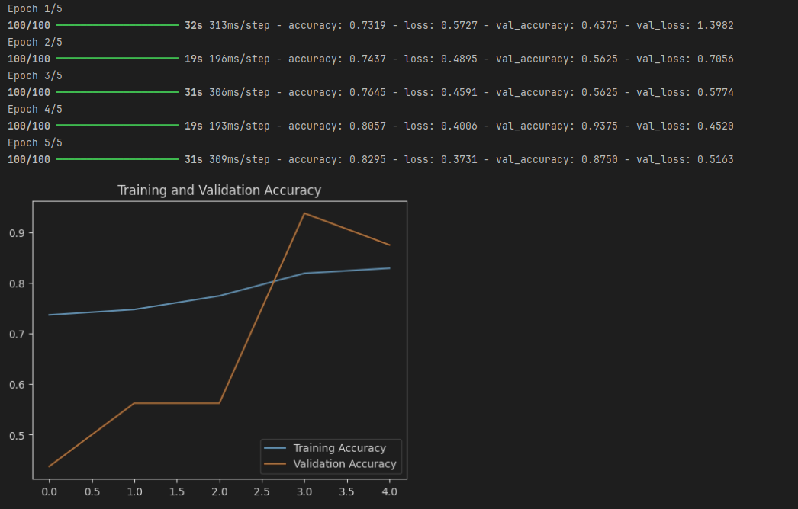
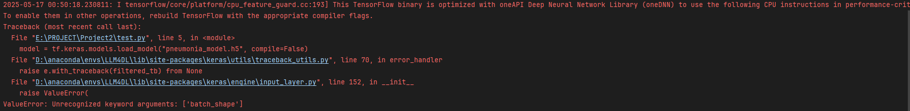
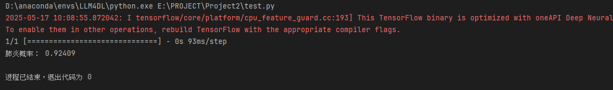

# 深度学习基础课程实验2
## 项目介绍
本项目基于深度学习基础（由张磊老师开设，课程代码为AIB310003）相关工程基础进行智能体的构建与新工具的实现
## 项目说明
本次实验：
* 使用LangChain构建工具增强的大语言模型智能体
* 基于实验一的模型，尝试将其转换为模型文件，保存为.h5格式文件，将该模型作为工具集成到智能体中
* 基于工具返回结果驱动 LLM 进行进一步推理与建议生成

## 具体目标与实现
### 目标 1：熟悉智能体构建步骤
#### 目标要求：
1. 获取API
2. 将PJ1中的模型转换为模型文件，根据API文档填写api key和base url，在本地机器运行示例代码
3. 学习和理解示例代码每个函数/模块的功能和用法

#### 目标实现

1. 第一步比较简单，因此跳过，注册领取就可以了
2. 第二步中，我们首先根据之前的模型也就是pj1中的CNN网络模型，在这里我们使用性能表现最好的模型进行实验，模型的具体代码见下方
```python
def create_model_1():
    model = models.Sequential([
        layers.Conv2D(32, (5, 5), activation='relu', input_shape=(150, 150, 3)),
        layers.Conv2D(32, (3, 3), activation='relu'),         
       
        layers.MaxPooling2D((3, 3)),
       
        layers.Conv2D(64, (3, 3), activation='relu'),
        layers.Conv2D(64, (3, 3), activation='relu'),         
       
        layers.MaxPooling2D((3, 3)),
        layers.Flatten(),
        layers.Dense(128, activation='relu'),
        layers.Dense(1, activation='sigmoid')
    ])
    return model
```
相关的性能表现见下图：


在这里直接使用语句save保存
```python
model.save("pneumonia_model.h5")
```
得到h5模型文件，将其放在当前项目下

此处使用test.py文件测试该模型是否能使用

测试语句如下所示：
```python
import tensorflow as tf
import numpy as np
from PIL import Image

model = tf.keras.models.load_model("pneumonia_model.h5", compile=False)

img = Image.open("test_example.jpeg").convert("RGB").resize((150, 150))
arr = np.expand_dims(np.array(img) / 255.0, axis=0)

prob = model.predict(arr)[0][0]
print("肺炎概率：", prob)
```
但是报错了。。。发现是版本不兼容问题


哈哈，这里是版本不兼容问题，我很好奇之前的实验是如何做到：

使用tensorflow 2.19.0 ，必须要keras>=3.5.0才能兼容的pj1，在pj2使用了keras==2.11.0，所以这个事情比较令人迷惑，也可能是鄙人才疏学浅。

anyway，于是决定在keras = 2.11.0的版本下，重新训练模型，得到如下结果：



